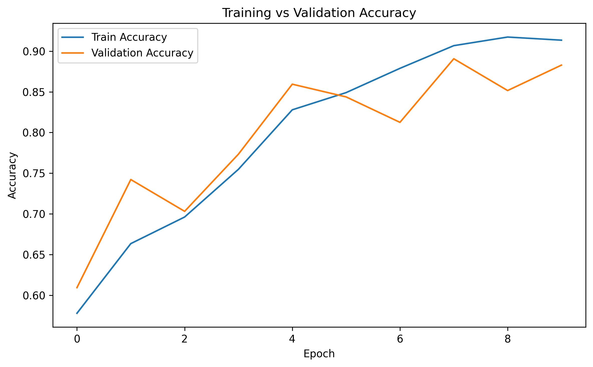
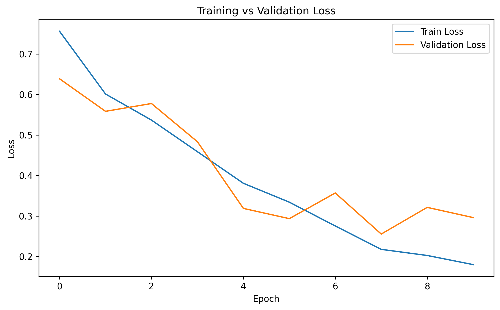
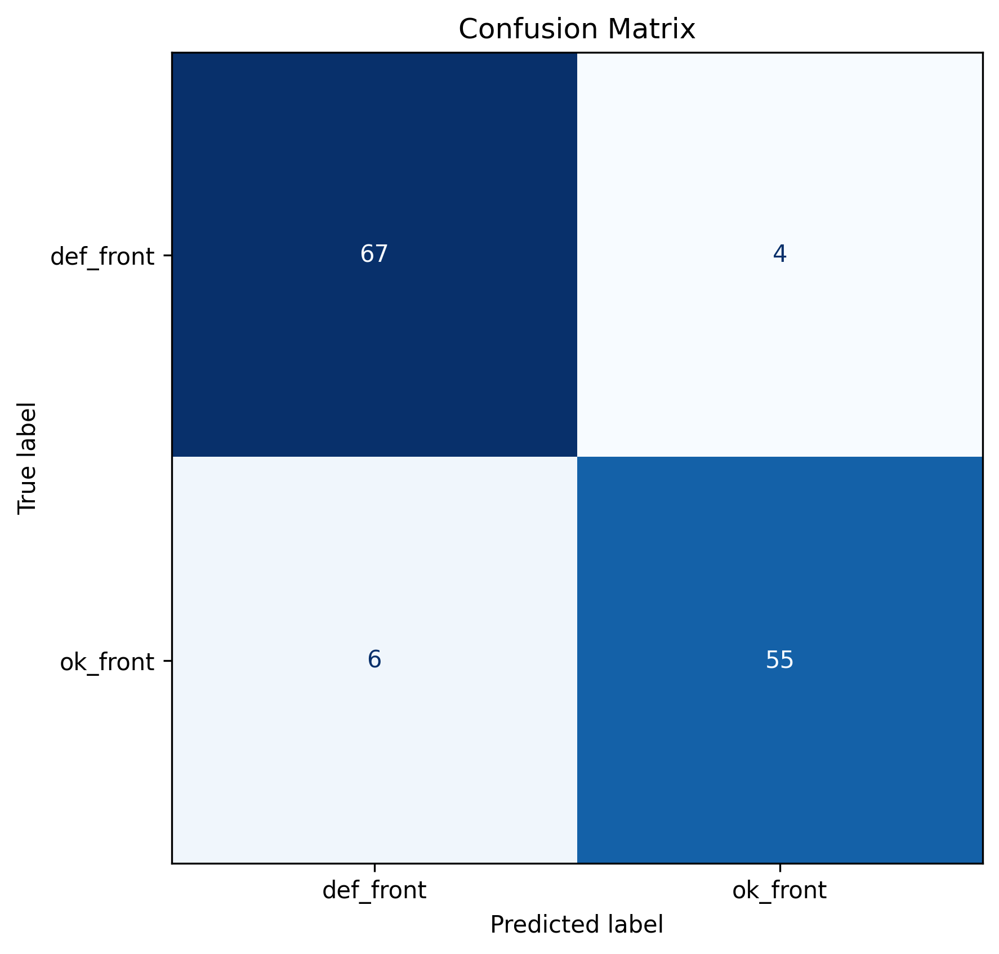
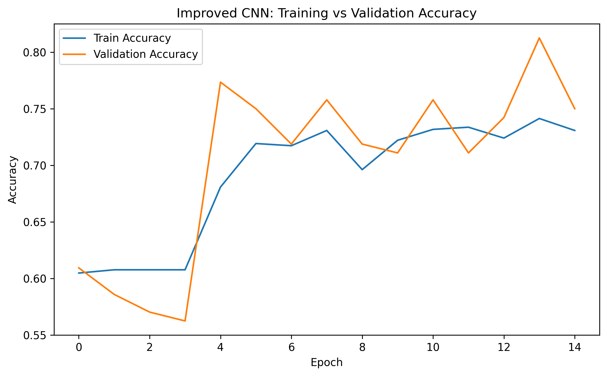
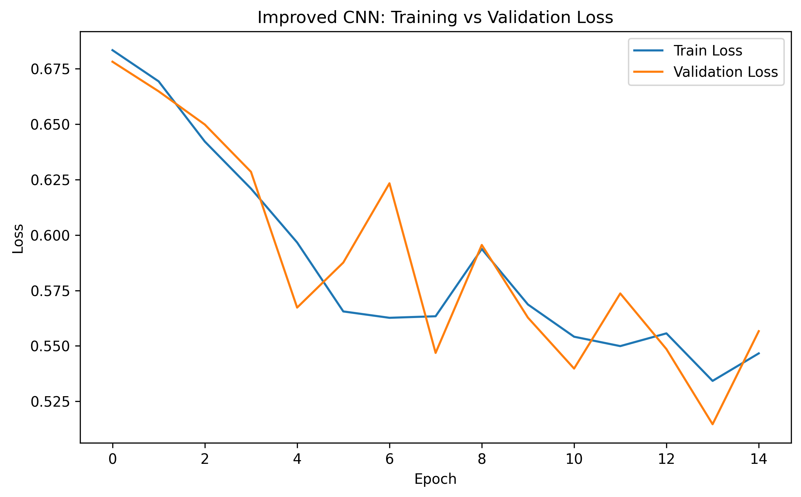
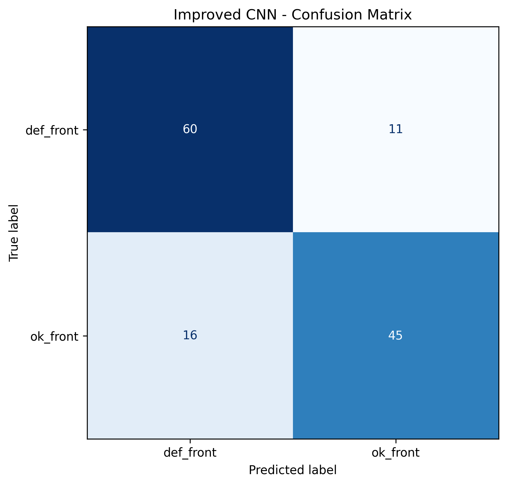

# Metal Casting Quality Control using CNNs

An end-to-end computer vision project for automated defect detection in metal casting images using Convolutional Neural Networks (CNNs). This project focuses on building a complete training and evaluation pipeline, comparing a strong baseline CNN with a lightweight alternative, and analyzing the trade-off between predictive performance and model efficiency.

---

## Table of Contents

- [1. Project Overview](#1-project-overview)
- [2. Problem Statement](#2-problem-statement)
- [3. Dataset](#3-dataset)
- [4. Repository Structure](#4-repository-structure)
- [5. Workflow](#5-workflow)
- [6. Data Preparation](#6-data-preparation)
- [7. Models](#7-models)
  - [7.1 Baseline CNN](#71-baseline-cnn)
  - [7.2 Lightweight CNN](#72-lightweight-cnn)
- [8. Training Setup](#8-training-setup)
- [9. Evaluation Metrics](#9-evaluation-metrics)
- [10. Results](#10-results)
  - [10.1 Baseline CNN Results](#101-baseline-cnn-results)
  - [10.2 Lightweight CNN Results](#102-lightweight-cnn-results)
  - [10.3 Model Comparison](#103-model-comparison)
- [11. Final Model Selection](#11-final-model-selection)
- [12. Key Learnings](#12-key-learnings)
- [13. How to Run](#13-how-to-run)
- [14. Limitations](#14-limitations)
- [15. Future Work](#15-future-work)
- [16. Conclusion](#16-conclusion)
- [17. Author](#17-author)

---

## 1. Project Overview

Manual visual inspection in manufacturing is repetitive, time-consuming, and often affected by human inconsistency. In metal casting quality control, defective parts must be detected reliably before they continue further in the production process.

This project develops a CNN-based inspection pipeline that classifies metal casting images into two categories:

- `def_front` → defective casting
- `ok_front` → non-defective / acceptable casting

The project is not limited to training one model. It also compares two CNN architectures to understand how model design affects:

- classification performance
- model size
- efficiency
- practical usability

---

## 2. Problem Statement

The goal of this project is to build an image classification system that can automatically determine whether a metal casting part is defective or non-defective from RGB image data.

### Task Type
Binary image classification

### Input
RGB images of metal casting parts

### Output
- Defective
- Non-defective

### Objective
To design, train, and evaluate CNN-based models for automated defect detection in metal casting images, and to compare a high-capacity baseline CNN with a lightweight alternative.

---

## 3. Dataset

This implementation uses a subset of the dataset containing **front-view metal casting images** only.

### Classes
- `def_front`
- `ok_front`

### Dataset Summary
- Total images: **1300**
- Defective images: **781**
- Non-defective images: **519**
- Image size: **512 × 512**
- Color mode: **RGB**
- Corrupted images found: **0**

### Observation
The dataset contains a moderate class imbalance, with more defective images than non-defective images.

---

## 4. Repository Structure

```bash
METAL_CASTING_QC/
│
├── data/
│   └── raw/
│       ├── def_front/
│       └── ok_front/
│
├── results/
│   ├── figures/
│   │   ├── accuracy_curve.png
│   │   ├── confusion_matrix.png
│   │   ├── improved_accuracy_curve.png
│   │   ├── improved_confusion_matrix.png
│   │   ├── improved_loss_curve.png
│   │   └── loss_curve.png
│   └── models/
│
├── src/
│   ├── data_preparation.py
│   ├── evaluate.py
│   ├── model.py
│   └── train.py
│
├── .gitignore
├── README.md
└── requirements.txt
## 5. Workflow

The project was developed as a complete machine learning pipeline:

1. **Dataset inspection**  
   The dataset was first explored to understand class distribution, image size, color mode, and possible data quality issues.

2. **Data preprocessing**  
   Images were resized, normalized, and prepared for CNN training.

3. **Dataset split creation**  
   Training, validation, and test datasets were created for model development and evaluation.

4. **Baseline CNN development**  
   A strong baseline CNN was designed to establish a performance benchmark.

5. **Baseline training and evaluation**  
   The baseline model was trained, evaluated, and analyzed using multiple classification metrics.

6. **Lightweight CNN development**  
   A smaller CNN architecture was designed to reduce parameter count and study the trade-off between efficiency and performance.

7. **Lightweight model training and evaluation**  
   The lightweight model was trained and evaluated using the same pipeline for fair comparison.

8. **Model comparison**  
   Both models were compared in terms of:
   - parameter count
   - classification performance
   - practical trade-offs

9. **Final model selection**  
   The final model was selected based on overall predictive performance and reliability.

---

## 6. Data Preparation

### Preprocessing Steps
The dataset preparation pipeline included the following steps:

- loading images from a class-based directory structure
- resizing images from **512×512** to **224×224**
- normalizing pixel values to the range **[0, 1]**
- creating train / validation / test datasets
- batching the data for efficient training

### Current Split Strategy
The current implementation uses an approximate:
- **80% training**
- **10% validation**
- **10% test**

### Why 224×224?
The images were resized to `224×224` because:
- it reduces computation cost
- it is a standard input size in CNN workflows
- it improves training efficiency while preserving enough visual detail for classification

---

## 7. Models

### 7.1 Baseline CNN

The baseline CNN was designed as a strong reference model.

#### Architecture
- Conv2D (32 filters)
- MaxPooling2D
- Conv2D (64 filters)
- MaxPooling2D
- Conv2D (128 filters)
- MaxPooling2D
- Flatten
- Dense (128)
- Dropout
- Dense (1, sigmoid)

#### Key Characteristic
The baseline model uses `Flatten()`, which produces a very large feature vector before the dense layer.

#### Parameter Count
**11,169,089**

#### Motivation
The purpose of the baseline model was to create a strong performance benchmark before attempting efficiency-oriented architecture changes.

---

### 7.2 Lightweight CNN

A second CNN was designed to study whether a much smaller model could still achieve useful performance.

#### Architecture
- Conv2D (32 filters)
- MaxPooling2D
- Conv2D (64 filters)
- MaxPooling2D
- Conv2D (128 filters)
- MaxPooling2D
- Conv2D (128 filters)
- GlobalAveragePooling2D
- Dense (64)
- Dropout
- Dense (1, sigmoid)

#### Key Characteristic
This model replaces `Flatten()` with `GlobalAveragePooling2D()`, which drastically reduces the number of trainable parameters.

#### Parameter Count
**249,153**

#### Motivation
The lightweight model was introduced to examine whether a compact architecture could provide competitive results while being significantly more efficient.

---

## 8. Training Setup

### Tools and Libraries
The project was implemented using:

- Python
- TensorFlow / Keras
- scikit-learn
- Matplotlib
- Pillow
- OpenCV

### Training Configuration
The following training choices were used:

- Optimizer: **Adam**
- Loss function: **Binary Cross-Entropy**
- Metrics:
  - Accuracy
  - Precision
  - Recall
- Early stopping used to restore the best weights
- Model checkpoint used to save the best-performing model

### Training Philosophy
The baseline model was trained first to establish a strong reference point.  
After that, a lightweight CNN was introduced to study whether efficiency improvements could be achieved without sacrificing too much classification performance.

---

## 9. Evaluation Metrics

The following metrics were used to evaluate model performance:

- Accuracy
- Precision
- Recall
- F1-score
- Confusion Matrix
- Classification Report

### Why accuracy alone is not enough
In industrial quality control, accuracy alone does not fully describe model usefulness. A model may still be risky if it misses defective parts.

One particularly important error is:

**False Negative**  
A defective part predicted as non-defective

This type of error is critical because a faulty product may pass inspection and continue into production or deployment.

---

## 10. Results

### 10.1 Baseline CNN Results

#### Test Performance
- Accuracy: **0.9167**
- Precision: **0.8906**
- Recall: **0.9344**
- F1-score: **0.9120**

#### Confusion Matrix
```text
[[64  7]
 [ 4 57]]

 #### Training Curves

##### Accuracy Curve


##### Loss Curve


##### Confusion Matrix Figure


#### Interpretation
The baseline CNN achieved the strongest overall performance. It classified both classes well and showed balanced behavior across precision and recall.

---

### 10.2 Lightweight CNN Results

#### Test Performance
- Accuracy: **0.7955**
- Precision: **0.8036**
- Recall: **0.7377**
- F1-score: **0.7692**

#### Confusion Matrix
```text
[[60 11]
 [16 45]]
#### Training Curves

##### Accuracy Curve


##### Loss Curve


##### Confusion Matrix Figure


#### Interpretation
The lightweight CNN was much smaller and more efficient, but its classification performance was clearly lower than that of the baseline model.

---

### 10.3 Model Comparison

| Model | Parameters | Accuracy | Precision | Recall | F1-score |
|------|-----------:|---------:|----------:|-------:|---------:|
| Baseline CNN | 11,169,089 | 0.9167 | 0.8906 | 0.9344 | 0.9120 |
| Lightweight CNN | 249,153 | 0.7955 | 0.8036 | 0.7377 | 0.7692 |

### Comparison Summary
The comparison shows a clear trade-off:

- the **Baseline CNN** achieved the best classification performance
- the **Lightweight CNN** drastically reduced parameter count
- the reduction in model size came with a noticeable drop in predictive performance

This makes the comparison meaningful from both a machine learning and an engineering perspective.

---

## 11. Final Model Selection

The **Baseline CNN** was selected as the final model for this project.

### Reason for Selection
Although the lightweight CNN was significantly smaller and more efficient, the baseline CNN provided substantially stronger classification performance and better overall reliability on the current dataset split.

### Final Decision
- **Selected model:** Baseline CNN
- **Why selected:** Best predictive performance and stronger overall evaluation metrics

---

## 12. Key Learnings

This project provided several important technical and practical insights:

### 1. Efficiency does not automatically guarantee better results
The lightweight CNN was much smaller, but it did not outperform the baseline model.

### 2. Architecture choices strongly influence learning behavior
Replacing `Flatten()` with `GlobalAveragePooling2D()` dramatically reduced model complexity and changed the model’s performance characteristics.

### 3. Model comparison improves project quality
Even though the lightweight CNN performed worse, including it made the final model selection more justified and professional.

### 4. Evaluation should be multi-metric
Accuracy alone is not enough for quality control tasks. Precision, recall, and confusion matrix analysis are also necessary.

### 5. Practical machine learning involves trade-offs
In real-world systems, model selection often requires balancing:
- predictive performance
- memory usage
- computational cost
- deployment practicality

---

## 13. How to Run

### 13.1 Create Environment

```bash
conda create -n metal_casting_qc python=3.11
conda activate metal_casting_qc
pip install -r requirements.txt
### 13.2 Train a Model

Set the model type inside `src/train.py`:

```python
MODEL_TYPE = "baseline"   # or "improved"
Then run:

```bash
python src/train.py

### 13.3 Evaluate a Model

Set the model type inside `src/evaluate.py`:

```python
MODEL_TYPE = "baseline"   # or "improved"
Then run:

```bash
python src/evaluate.py

## 14. Limitations

This project currently has several limitations:

- only a subset of the full dataset was used (`def_front` and `ok_front`)
- the train / validation / test split is approximate
- no transfer learning baseline was included
- no data augmentation was added
- no explainability method such as Grad-CAM was implemented
- no deployment stage was included

---

## 15. Future Work

Several possible improvements can be explored in the future:

- use the full metal casting dataset instead of only the front-view subset
- implement a more controlled stratified split
- add data augmentation
- compare with transfer learning models
- perform hyperparameter tuning
- add explainability methods such as Grad-CAM
- optimize the final system for real-time industrial deployment

---

## 16. Conclusion

This project successfully developed an end-to-end CNN-based quality control pipeline for metal casting defect detection.

Two different CNN architectures were studied:

- a strong baseline CNN with high classification performance
- a lightweight CNN with dramatically fewer parameters

The experiments showed that:

- the **Baseline CNN** achieved the best predictive performance
- the **Lightweight CNN** was much more efficient, but less accurate
- model selection in industrial computer vision should consider both **performance** and **efficiency**

Overall, this project demonstrates not only implementation ability, but also model comparison, evaluation, and engineering reasoning for practical AI-based quality inspection.

---

## 17. Author

**Arefin Aziz Sifat**  
Master’s Student, AI Engineering of Autonomous Systems  
Technische Hochschule Ingolstadt
